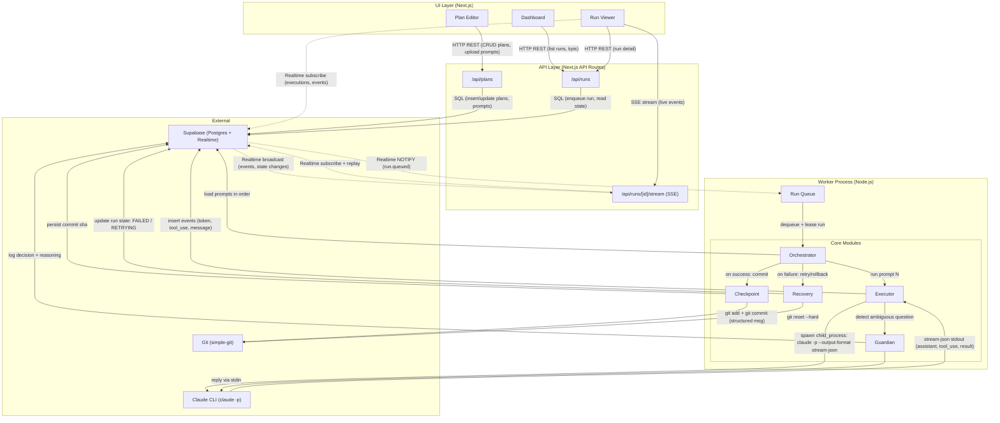

# Component Architecture

This document maps the major components of Conductor and the wires between them. The diagram is intentionally process-aware: the UI, API, and Worker are separate runtime concerns, even when they ship together in Docker Compose.

## Component Diagram

## Component Responsibilities

### UI Layer

**Dashboard.** The landing surface. Lists recent runs with status badges (queued, running, completed, failed), surfaces aggregate KPIs (success rate, avg run duration, prompts executed today), and offers a one-click "New Run" entry point. Reads exclusively via `/api/runs` and Supabase Realtime for live status updates.

**Plan Editor.** Lets the operator author a Plan: drag-and-drop a folder of prompts, edit frontmatter inline, reorder steps, validate the plan against schema. Persists via `/api/plans`. Shows a dry-run preview of what will be executed.

**Run Viewer.** The live execution view. Renders the Plan as a vertical timeline; each Prompt has a streaming pane that shows Claude's stdout in real time (token-by-token via Supabase Realtime), Guardian decisions inline, and per-step git diffs. Subscribes to both the SSE bridge (for browser-friendly streaming) and Supabase Realtime channels (for state changes).

### API Layer

**`/api/plans`.** REST endpoints for Plan CRUD: create, read, update, delete, list. Validates uploaded prompt folders (frontmatter schema, ordering, file naming), persists to Postgres. Stateless — does no execution, only metadata.

**`/api/runs`.** REST endpoints for Run lifecycle: enqueue a new run (insert row with status `queued`, the Worker picks it up via Realtime), cancel a run, fetch run detail, list runs. Does not spawn Claude — that's the Worker's job.

**`/api/runs/[id]/stream` (SSE).** A Server-Sent Events bridge that subscribes to Supabase Realtime server-side and proxies events to the browser as a long-lived `text/event-stream`. Used by clients that prefer SSE over the Supabase JS Realtime client (or behind proxies that mangle WebSockets).

### Worker Process

**Run Queue.** Listens to Supabase Realtime for `run.status = queued` inserts, leases the run (atomic update to `running`), hands it to the Orchestrator. Single-tenant by default — runs sequentially to avoid Claude CLI auth conflicts and working-directory races. Run dequeue uses an atomic PostgreSQL `UPDATE ... WHERE status='queued' ... RETURNING` to prevent double-processing by concurrent workers. Recovery module owns the retry/rollback decision; Checkpoint module executes git operations.

### Core Modules

**Orchestrator.** Owns the run-level state machine. Loads the Plan's prompts in order, calls the Executor per prompt, decides whether to checkpoint or invoke Recovery based on the Executor's verdict. Persists state transitions to Postgres so the run is resumable across crashes.

**Executor.** The thin layer over `child_process.spawn('claude', ['-p', '--output-format', 'stream-json', ...])`. Pipes the prompt body to stdin, parses each JSON line from stdout, classifies events (`assistant_message`, `tool_use`, `result`, `error`), and writes them to the `events` table. Surfaces "Claude needs input" signals to the Guardian.

**Guardian.** The auto-decision agent. Receives ambiguous-question signals from the Executor, runs a heuristics pass first (regex against known question shapes — overwrite confirmations, technology choices, etc.), falls back to a small LLM call when no heuristic matches, and writes its decision plus reasoning to the `guardian_decisions` table. Replies to Claude via the child's stdin.

**Checkpoint.** Wraps `simple-git`. After a successful prompt, stages all changes in the working directory, commits with a structured message (`conductor: run=<run_id> prompt=<prompt_id> step=N/M`), and persists the resulting commit SHA against the Execution row. The git history of a run is the audit trail.

**Recovery.** The failure path. On Executor errors, applies an exponential backoff retry policy (configurable per prompt via frontmatter). When the retry budget is exhausted, calls `simple-git` to `reset --hard` the working directory to the last successful checkpoint SHA, marks the Run as `FAILED`, and emits a final event so the UI updates immediately.

### External

**Claude CLI (`claude -p`).** The execution engine. Spawned per Execution, lives only for the duration of one prompt. Authenticated by an OAuth long-lived token established once via `claude setup-token`. Communicates exclusively via stdin (prompt body, Guardian replies) and stdout (`stream-json` events).

**Git (`simple-git`).** Operates against the user-specified working directory. Used only by Checkpoint (commit) and Recovery (reset). Conductor never modifies git config or pushes to remotes — checkpoints are local commits the operator can inspect, amend, or push at their discretion.

**Supabase.** Three roles: Postgres holds all durable state (plans, runs, executions, events, guardian_decisions); Realtime fans out row changes to the UI and signals queued runs to the Worker; Auth gates the operator-facing UI. Can run locally via `supabase start` or against a hosted project — the rest of Conductor doesn't care.
