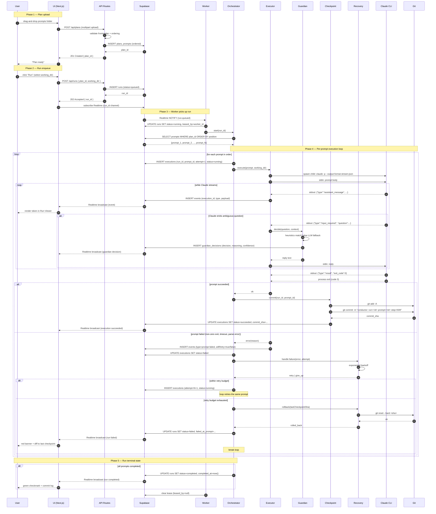

# Data Flow — Run Lifecycle

This document traces a complete Run from upload to terminal state. The sequence covers the happy path (prompts execute cleanly, Checkpoints commit), the Guardian intervention path (Claude asks an ambiguous question), and the Recovery path (a prompt fails, retries, and ultimately rolls back).

## Sequence Diagram

## Step-by-Step Narrative

### 1. Plan Upload (steps 1-7)
The operator drops a folder of `.md` prompts into the Plan Editor. The UI POSTs the multipart payload to `/api/plans`. The API validates each file's frontmatter (required keys: `id`, `title`, `timeout`, optional `retry_policy`) and the ordering (explicit `position` or filename prefix). On success, plans and prompts are inserted into Postgres in a single transaction, and the new `plan_id` is returned. No execution happens yet.

### 2. Run Enqueue (steps 8-13)
The operator selects the Plan, picks a working directory, and clicks Run. The UI POSTs to `/api/runs`. The API inserts a row into `runs` with `status=queued` and returns 202 Accepted. The UI immediately subscribes to the Supabase Realtime channel for that `run_id` so it can render updates as they arrive — even before the Worker has picked up the run.

### 3. Worker Pickup (steps 14-18)
Supabase Realtime notifies the Worker that a row was inserted into `runs` with `status=queued`. The Worker performs an atomic `UPDATE` to claim the run (sets `status=running` and `leased_by=worker_id` only if still queued — this prevents double-pickup if multiple workers ever exist). The Orchestrator loads the Plan's prompts in order.

### 4. Per-Prompt Execution Loop (steps 19-52)
For each prompt, the Orchestrator creates an `executions` row and hands control to the Executor. The Executor spawns `claude -p --output-format stream-json` as a child process and writes the prompt body to stdin. Each line of stdout is parsed as a JSON event and inserted into the `events` table; Supabase Realtime fans those rows out to the Run Viewer instantly.

**Guardian intervention.** When the Executor sees an `input_required` event (Claude is asking a clarifying question), it pauses and calls the Guardian. The Guardian runs heuristics first (regex against canonical question shapes — overwrite prompts, tech-choice questions, etc.). If no heuristic matches, it makes a small LLM call with the question and the run's context. The decision and its reasoning are persisted to `guardian_decisions` (so the operator can audit and tune). The Guardian's reply text is written back to Claude via the child's stdin, and the stream resumes.

**On success.** When Claude emits a final `result` event with exit code 0 and the process exits cleanly, the Orchestrator hands the prompt to the Checkpoint module. Checkpoint runs `git add -A` and `git commit` with a structured message that encodes the `run_id`, `prompt_id`, and step counter. The resulting commit SHA is persisted onto the Execution row. The UI receives a Realtime broadcast and shows a green checkmark plus the diff.

**On failure.** Non-zero exit, timeout, or stream parse error all funnel through Recovery. If the prompt is within its retry budget (configurable per prompt via frontmatter, default 3 attempts), the Orchestrator computes an exponential backoff (`base * 2^attempt`), creates a new Execution row with an incremented `attempt`, and re-runs. If the budget is exhausted, Checkpoint rolls the working directory back to the last successful commit (`git reset --hard <last_good_sha>`), the Run is marked `failed`, and the UI surfaces a red banner showing the diff between attempted state and the rollback target.

### 5. Terminal State (steps 53-57)
If the loop completes without breaking, the Orchestrator marks the run `completed` with a timestamp. The UI receives a final Realtime broadcast and renders the full commit log — a clean, bisectable git history of the entire automated session. The Worker clears its lease, freeing it to pick up the next queued run.

## What's Persistent vs. Transient

- **Persistent (Postgres):** plans, prompts, runs, executions, events, guardian_decisions, commit SHAs. Survives any crash.
- **Persistent (Git):** every successful prompt's diff, captured as a real commit in the working directory.
- **Transient (Worker memory):** the live Claude child process, the in-flight stream parser state. If the Worker crashes mid-prompt, that Execution is marked `failed` on restart and Recovery decides whether to retry or roll back — no state is silently lost because every event was already streamed to Postgres before being acknowledged.
